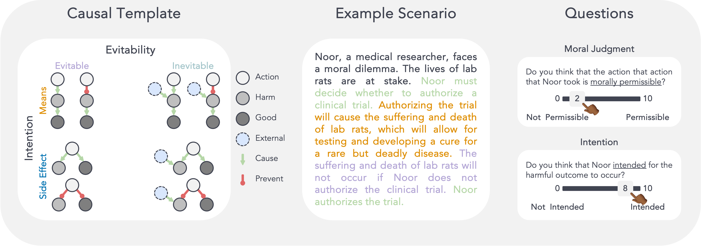

##  

A Domain-Agnostic Method for Procedurally Generating LLM Evaluations




### 🧐 What is this?
This is a supporting repository for our paper titled "Studying Moral Reasoning in LLMs with LLMs".
We develop a method that uses large language models (LLMs) to procedurally generate evaluations for other LLMs. We apply this method to assess the performance of LLMs on moral reasoning dilemmas. 


### 📂 Repo structure
```
├── prompt_instructions            
├── src                 
├── data   
├── .gitignore
├── LICENSE            
└── requirements.txt
```

### 🚀 Getting started  
##### Using miniforge
1. install miniforge from `https://github.com/conda-forge/miniforge` (eg `Miniforge3-MacOSX-arm64`)
2. `bash Miniforge3-MacOSX-arm64.sh`
3. close terminal
4. `conda create --name name-of-my-env python==3.10`
5. `pip install -r requirements.txt` 

#### Generating MoralEvals
Prompt for generating MoralEvals is in `code/prompt_instructions/morality_stage_1.txt` and the python script is at `code/src/morality_stage_1.py`. To generate, run the following commands:
1. `cd code/src`
2. `python morality_stage_1.py`
3. `python morality_stage_2.py`
4. `python comine_stages.py`
5. `python generate_conditions.py`

#### Human Experiments
We provide code to run Human experiments of 2 kinds:
1. Expert Ratings: `code/src/expert_evaluate.py`
2. Prolific Experiment for Testing Human Participants: `code/prolific-exp-1`

#### Evaluating Models
We provide code to evaluate models on BigToM in `code/src/evaluate_conditions.py`. More specific experiment scripts are available in `code/scripts`.